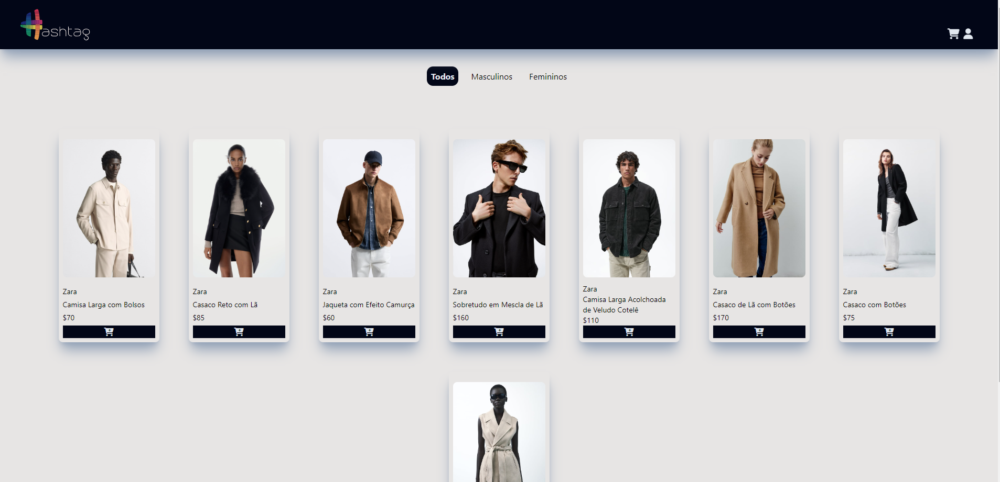

<h1 align="center">
  <p>Projeto Ecommerce</p>
</h1>

<br>

  <p align="center">
    
  </p>

<br>

## 🚨 Sobre

Projeto desenvolvido no Intensivão de JavaScript da Hashtag, basicamente é um front-end de um ecommerce.

- [Acesso o projeto finalizado, online](https://miguelnfariass.github.io/front-ecommerce/)

## 🚀 Tecnologias

Esse projeto foi desenvolvido com as seguintes tecnologias:

- HTML e CSS
- JavaScript
- [Node](https://nodejs.org/en)
- [Tailwind](https://tailwindcss.com/)

## 💻 Funcionalidades

- Filtrar roupas;
- Adicionar itens ao carrinho;
- Finalizar a compra;
- Ver compras realizadas.

## ⚡ Instação

Clone o projeto

```
git clone https://github.com/miguelnfariass/front-ecommerce.git
```

Entre no diretório

```
cd front-ecommerce
```

Instale as dependências

```
npm i
```

Inicie o servidor

```
npm run rev
```

## Licença

[MIT](https://choosealicense.com/licenses/mit/)
